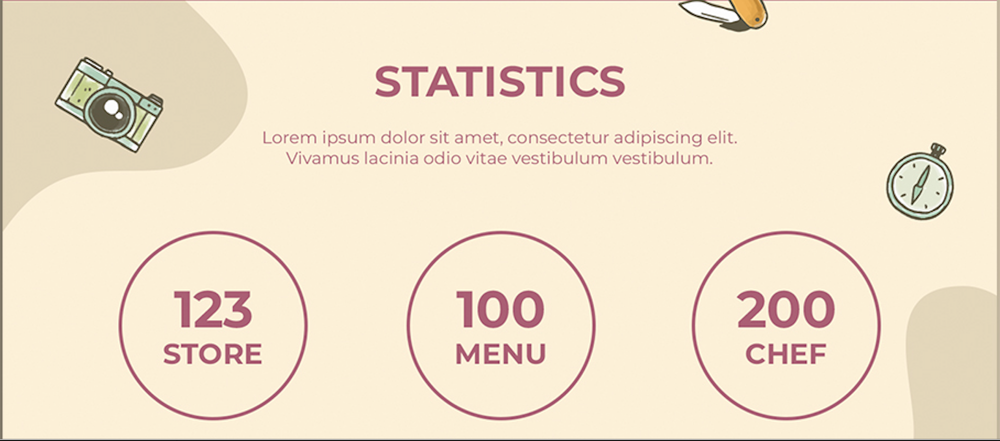

# Contributors

Welcome to the Git-Practice project! This document is designed to help you understand how to work with branches in Git.

Each one of you will be in charge of developing a feature in a separate branch. Here is the list:

Awais

- Navbar and hero feature - feature/Navbar-Hero

Camille

- Our Team section - feature/Our-Team

Dovydas

- Feature time to hike section - feature/Time-to-hike
  

Ernest

- Feature Statistics section - feature/Statistics

Mamonur

- Feature Tour Guide section - feature/Tour-Guide

Robert

- Feature Footer section - feature/Footer

 

There are some sections that have not been assigned yet. If you would like to take on one of these features, please let me know!
