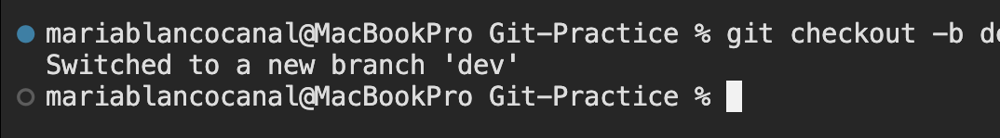
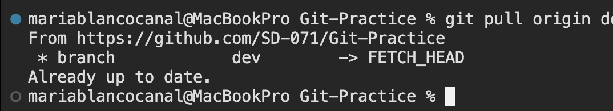
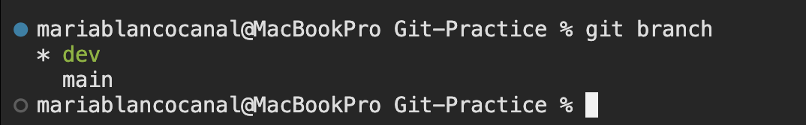
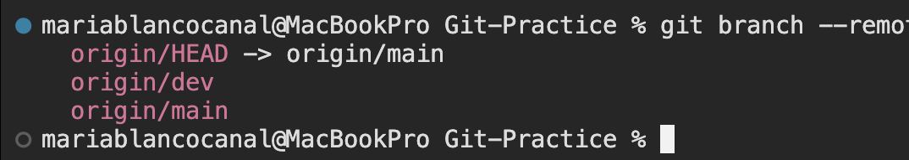
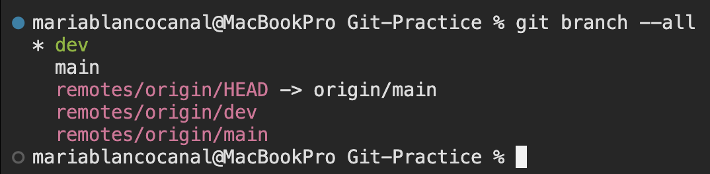

# Git-Practice
Repository to do a group practice of the git and github flow

## 🌿 Beginner Git & GitHub Activity: Branching Practice
🎯 Goal

 - Cloning a repository

 - Creating and switching branches

 - Making commits

 - Pushing branches to GitHub

 - Creating a pull request

 - Reviewing and merging changes

## Day 1 - Using Branches
### Instructions

Step 1 - Creating Dev

#### 1️⃣ Clone the repository...

    git clone <repo-url>
    cd Git-Practice

#### ...and check your connection to the remote repository:

    git remote -v

This should show the address of the repository in github:

#### 2️⃣ Create the dev branch from main and switch to it

    git checkout -b dev

You will see something like this in your teminal:

This means that you have created a new branch called dev and switched to it.

#### 3️⃣ Pull the origin/dev branch to your local branch

    git pull origin dev

This will pull all of the changes from the remote dev branch to your local dev branch. You will see something like this in your terminal:

In this case, as I created the dev branch and pushed it with the content, there were no new changes to pull, so the output shows "Already up to date." In your case, you will see instead a list of files that were updated.

Step 2 - Exploring Branches

#### 1️⃣ Check your local branches

    git branch

You will see a list with your local branches:

The branch with the asterisk (*) is the one you are currently in.

#### 2️⃣ Check the remote branches

    git branch --remote

You will see a list with your remote branches:

This shows the branches that are in the remote repository. The origin/ prefix indicates that these branches are in the remote repository named origin.

#### 3️⃣ Check both remote and local branches

    git branch --all

You will see a list with all the branches, local and remote ones:

Step 3 - Creating feature branches

#### 1️⃣ Create a feature branches from dev but don't switch to it

    git branch feature/<feature-to-implement>

This will create a new branch called feature/feature-to-implement from the current branch (dev), but you will remain in the dev branch.

<i style="color: orange">In the Contributors.md file, you will have a feature assigned to you for this project, so use that to create the name of your branch.</i>

If you have issues with naming branches, here you have an article about <a href="https://medium.com/@abhay.pixolo/naming-conventions-for-git-branches-a-cheatsheet-8549feca2534" target="_blank">naming branches conventions</a>.

#### 2️⃣ List your local branches to see the new feature branch

    git branch

#### 3️⃣ Switch to your new feature branch

    git checkout feature/<feature-to-implement>

#### 4️⃣ Make changes to the Contributors.md file
Open the Contributors.md file in your code editor and add your name and a link to your GitHub profile under the appropriate section.

#### 5️⃣ Stage your changes

    git add Contributors.md

#### 6️⃣ Commit your changes

    git commit -m "Add <your-name> to Contributors"

#### 7️⃣ Check the status of your branch

    git status

#### 8️⃣ Push your feature branch to the remote repository

    git push -u origin feature/<feature-to-implement>

This will push your feature branch to the remote repository and set the upstream branch, so the remote and local branches are connected.

#### 9️⃣ Write the html code for the feature you have been assigned

Open the index.html file in your code editor and add the html code for the feature you have been assigned.

#### 🔟 Stage, commit, and push your changes

    git add index.html
    git commit -m "Implement <feature-to-implement>"
    git push

Once you have pushed your changes, you can go to the GitHub repository and see your feature branch with the changes you made.

## Day 2 - Protecting Branches and PRs
### Instructions

## Day 3 - Merging Branches Locally
### Instructions

