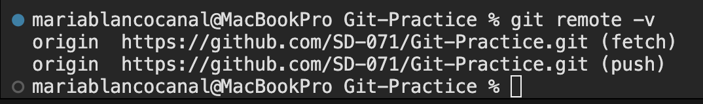

# Git-Practice
Repository to do a group practice of the git and github flow

## 🌿 Beginner Git & GitHub Activity: Branching Practice
🎯 Goal

 - Cloning a repository

 - Creating and switching branches

 - Making commits

 - Pushing branches to GitHub

 - Creating a pull request

 - Reviewing and merging changes

## Day 1 - Using Branches
### Step 1 - Creating Dev
#### 1️⃣ Clone the repository...

    git clone <repo-url>
    cd Git-Practice

#### ...and check your connection to the remote repository:

    git remote -v

This should show the address of the repository in github:

#### 2️⃣ Create the dev branch from main and switch to it

    git checkout -b dev

#### 3️⃣ Pull the origin/dev branch to your local branch

    git pull origin dev

#### 4️⃣ Check your local branches

    git branch

You will see a list with your local branches:

#### 5️⃣ Check the remote branches

    git branch --remote

You will see a list with your remote branches:

#### 6️⃣ Check both remote and local branches

    git branch --all

You will see a list with all the branches, local and remote ones.

## Day 2 - Protecting Branches and PRs
### Instructions

## Day 3 - Merging Branches Locally
### Instructions

